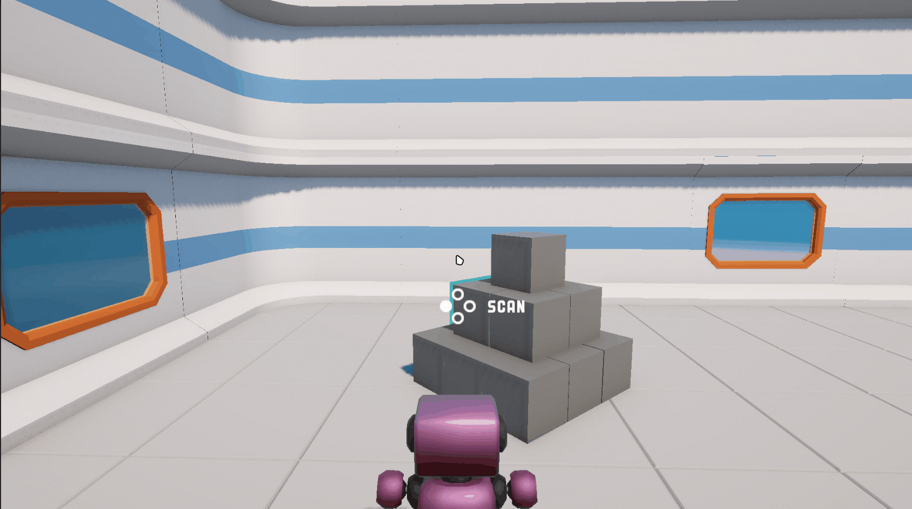
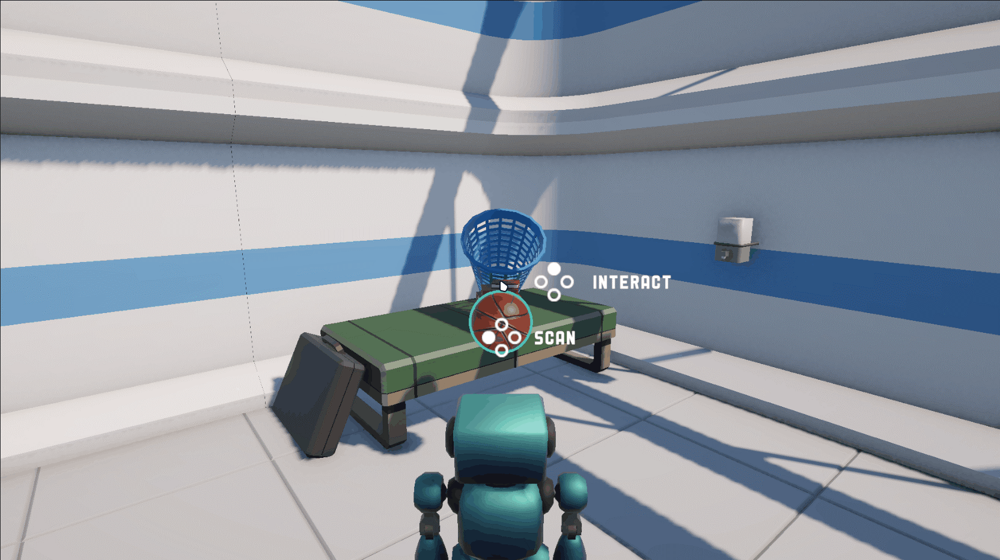

## Pattern Recognition: Failed

A first-person exploration game built in **Unity** with **C#**, centered around a "scanning" mechanic where a malfunctioning robot must interpret everyday objects — and those interpretations evolve the longer you interact with them.

🎮 Play it here: [Pattern Recognition: Failed on itch.io](https://mischief-labs.itch.io/pattern-recognition-failed)

## Features

- **Scan & Interpret System —**
  Objects must be scanned before they can be interacted with. Scanning triggers a robot-voice interpretation that gets logged to a scan journal the player can review at any time.
- **Evolving Descriptions —**
  Some objects unlock new interpretations through continued interaction (hold a Lego long enough, sink enough baskets with the basketball) and the robot's understanding shifts. Players are notified and prompted to re-check the scan log.
- **Pick-up & Throw Mechanics —**
  Holdable objects (Lego bricks, a basketball, a data chip) float in front of the player and respond to input. The basketball can be thrown; the chip can be slotted into a panel.
- **Timed Puzzle Loop —**
  The main objective involves synthesizing a data chip and uploading it to a control panel, each with real-time countdowns displayed in the HUD.
- **Reactive UI —**
  A slide-in banner system delivers contextual updates (new interpretations, upload progress, narrative beats). A scan log menu shows the robot's current understanding of each scanned object.

## What I Learned

- **Interactable architecture —**
  An abstract `Interactable` base class handles scanning, focus/outline states, and the interact pipeline. Subclasses (`Lego`, `Basketball`, `ChipSynthesiser`, etc.) override only what they need, keeping behaviour isolated and composable.
- **State-driven coroutines —**
  Multi-stage timed processes (synthesis, upload) run as coroutines with an enum state machine, preventing double-triggers and updating the UI each frame while active.
- **Input routing & held-object logic —**
  `PlayerInteraction` manages what happens when the player presses interact depending on what they're holding and what they're looking at — including special-cased interactions like inserting a chip into a panel.
- **Static shared state —**
  Objects like `Block` use static flags and a shared instance list so scanning one block transforms all of them simultaneously, without a central manager needing to track them.

## Preview

